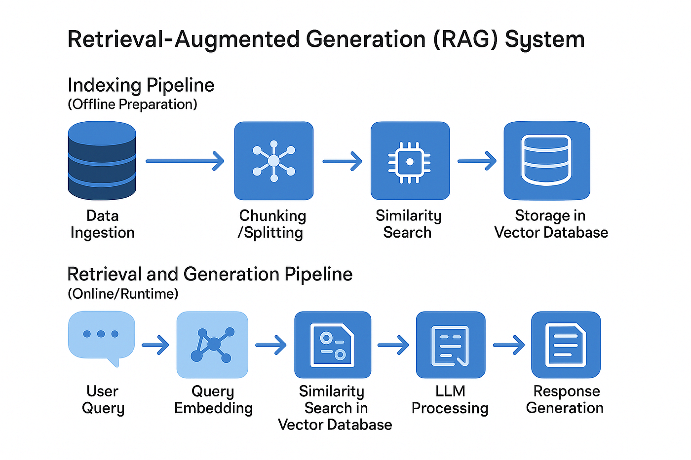

# RAG Semantic Search

A modular **Retrieval-Augmented Generation (RAG)** system for **document ingestion, semantic search, and question answering** using vector embeddings and Large Language Models (LLMs).

This repository is structured as a **monorepo** and contains two main components:
- **rag-ingest** – document ingestion and vectorization pipeline
- **rag-query** – semantic search and RAG-based querying over the vector database

Designed to explore trade-offs between different chunking strategies and their impact on retrieval quality in RAG systems.

---

## Architecture Overview



The system follows a standard RAG architecture:

1. Documents (text, PDFs, images) are ingested and processed
2. Content is split into chunks using different chunking strategies
3. Vector embeddings are generated and stored in a vector database
4. User queries retrieve relevant chunks via semantic similarity
5. An LLM generates answers using the retrieved context

---

## Highlights
- Modular RAG architecture (ingestion + query separation)
- Multiple chunking strategies (semantic, recursive, LLM-based)
- Vector search with ChromaDB
- CLI-based interaction
- Designed with production-like structure

## Repository Structure

```text
RAG/
├── rag-ingest/        # Document ingestion & vectorization pipeline
├── rag-query/         # Semantic search & RAG query engine
├── rag-setup-docs/    # Additional documentation
├── README.md
```

## rag-ingest – Ingestion Pipeline

Responsible for extracting content from documents, chunking it, generating embeddings, and storing them in a vector database.

### Key features:
- Multiple **chunking strategies**:
  - Recursive chunking
  - Semantic chunking
  - LLM-based chunking
  - Markdown-aware chunking
- Support for multiple input types:
  - Plain text
  - PDF documents
  - Images (OCR / vision-based extraction)
- Modular ingestion pipeline with clear separation of responsibilities

### Main components:
- `processors/` – content extractors (PDF, text, vision)
- `core/Chunkers/` – pluggable chunking strategies
- `ingestion_pipeline.py` – pipeline orchestration
- `vector_db.py` – vector database interface

---

## rag-query – Query & RAG Engine

Provides semantic search and Retrieval-Augmented Generation over the vector database created by `rag-ingest`.

### Key features:
- Semantic similarity search over vector embeddings
- Retrieval-Augmented Generation (RAG)
- Command-line interface (CLI) for querying
- Clean and extensible query architecture

### Main components:
- `query_engine.py` – orchestrates retrieval and generation
- `generator.py` – LLM-based response generation
- `vector_db.py` – vector database access
- `cli.py` – command-line interface

---

## Tech Stack

- **Python**
- **OpenAI API**
- **ChromaDB** (vector database)
- **Pydantic / Pydantic-Settings**
- **Click** (CLI framework)

---
## Setup

```bash
git clone https://github.com/your-username/rag-semantic-search.git
cd RAG
```
Each module (rag-ingest, rag-query) is self-contained and uses Pipenv for dependency management.

Install dependencies separately for each module:

cd rag-ingest
pipenv install

cd ../rag-query
pipenv install

## Environment configuration
Each module requires a .env file (not committed to GitHub).
Use the provided .env.example files as a template.

Example variables:

OPENAI_API_KEY=your_openai_api_key
OPENAI_MODEL_NAME=gpt-4

CHROMA_PERSIST_DIRECTORY=./rag-data/vector_db
CHROMA_COLLECTION_NAME=documents


## Usage

### Run ingestion (rag-ingest)

```bash
pipenv run python -m rag_ingest
```

### Run queries (rag-query)

```bash
pipenv run python -m rag_query.cli query "What is the main topic of the documents?"
pipenv run python -m rag_query.cli search "machine learning"
```

## Notes
Running queries requires a valid OpenAI API key. 

The rag-data directory (vector database and local data) is intentionally excluded from version control.

This project focuses on clean architecture, modularity, and best practices for building scalable RAG systems.

Designed as a learning and portfolio project with production-oriented structure.

This project was developed as part of an internship and is intended for learning and experimentation purposes.

## Use Cases
Semantic document search

Question answering over internal knowledge bases

RAG-based AI assistants


```md
## Future Improvements
- Evaluation metrics for retrieval quality
- Support for hybrid search (keyword + vector)
- Web interface for querying

Experimentation with chunking and retrieval strategies

